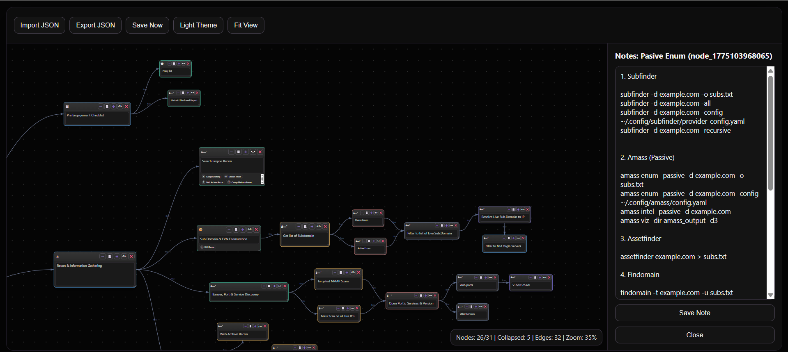

# Bug-Bounty-Framework

### Interactive Mind Map for Pentesting & Bug Hunting

A structured, visual **bug bounty methodology framework** built using a JSON-based tree viewer to help security researchers  **plan, track, and execute real-world attack workflows** .

This project transforms traditional notes and checklists into an  **interactive attack map** , allowing you to systematically navigate every stage of bug hunting — from reconnaissance to exploitation.

---

## 🧠 Why This Exists

Bug bounty hunting is not about running tools randomly — it’s about following a  **structured methodology** .

However, most resources today are:

* Scattered across blogs, notes, and cheat sheets
* Difficult to follow consistently
* Easy to forget critical steps

This framework solves that by providing:

* A **clear visual workflow**
* A **step-by-step attack path**
* A way to **organize and track testing progress**

---

## ⚙️ Features

* 🌳 **JSON-Based Tree Structure**
* Fully customizable methodology
* Easy to expand and modify
* 🧭 **End-to-End Workflow**
* Recon → Enumeration → Analysis → Exploitation → Reporting
* 🔀 **Structured Attack Paths**
* Organized testing strategies for:
  *  Web applications
  *  APIs
  *  Authentication
  *  Cloud targets
* 🛠️ **Tool Mapping**
* Associate steps with tools like:
  *  Amass
  *  Subfinder
  *  httpx
  *  ffuf
  *  nuclei
* 🧠 **Methodology-Driven Approach**
* Focus on  *what to test next* , not just tools

---

## 🎯 Use Cases

* Bug bounty hunters building a consistent workflow
* Pentesters managing complex engagements
* Beginners learning structured security testing
* Advanced researchers mapping attack chains
